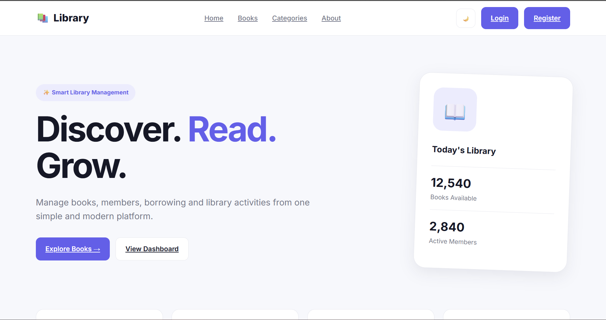
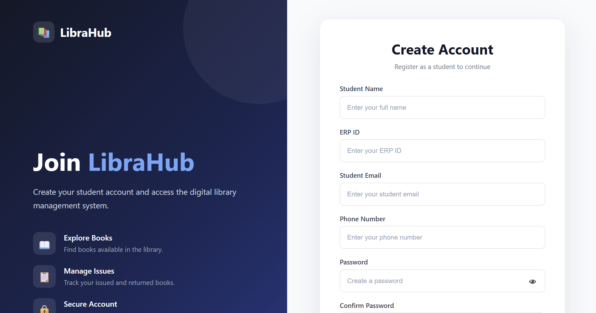
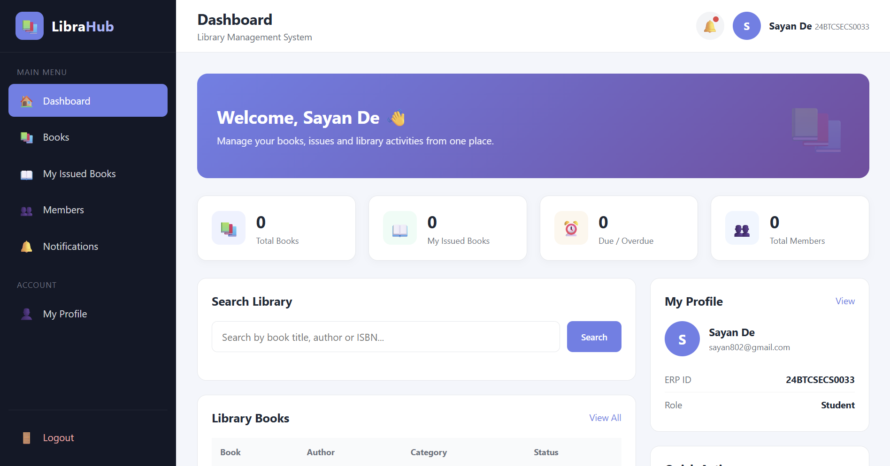

# 📚 Library Management System

A full-stack **Library Management System (LMS)** designed to manage books, members, authentication, and book-issue operations through a simple and responsive web interface.

The project uses **HTML, CSS, and JavaScript** for the frontend, **Python** for the backend, and **MySQL** for database management.

---

## 🚀 Project Overview

The Library Management System provides a centralized platform for managing library operations digitally.

The system allows users to:

* 🔐 Register and log in securely
* 👤 Manage library members
* 📚 Explore and manage books
* 📖 Issue books to members
* 🔄 Manage book issue records
* 📊 View library information through a dashboard
* 🚪 Logout securely
* 🗄️ Store and manage data using MySQL

The project follows a simple **Frontend → Backend → Database** architecture.

---

## 🛠️ Technologies Used

### Frontend

| Technology | Purpose                       |
| ---------- | ----------------------------- |
| HTML5      | Structure of web pages        |
| CSS3       | Styling and responsive design |
| JavaScript | Client-side functionality     |

### Backend

| Technology    | Purpose                                             |
| ------------- | --------------------------------------------------- |
| Python        | Backend programming                                 |
| Flask         | Web framework / API handling                        |
| Python Routes | Authentication, books, members and issue management |

### Database

| Technology | Purpose                     |
| ---------- | --------------------------- |
| MySQL      | Database management         |
| SQL        | Database schema and queries |

---

## 🏗️ System Architecture

```text
                 ┌─────────────────────┐
                 │      Frontend       │
                 │                     │
                 │ HTML + CSS + JS     │
                 └──────────┬──────────┘
                            │
                            │ HTTP Requests
                            ▼
                 ┌─────────────────────┐
                 │       Backend       │
                 │                     │
                 │ Python + Flask      │
                 │                     │
                 │ ┌─────────────────┐ │
                 │ │ Auth Routes     │ │
                 │ │ Books Routes    │ │
                 │ │ Members Routes  │ │
                 │ │ Issues Routes   │ │
                 │ └─────────────────┘ │
                 └──────────┬──────────┘
                            │
                            │ SQL Queries
                            ▼
                 ┌─────────────────────┐
                 │      Database       │
                 │                     │
                 │       MySQL         │
                 │                     │
                 │ Users               │
                 │ Books               │
                 │ Members             │
                 │ Issues              │
                 └─────────────────────┘
```

---

# 📂 Project Structure

```text
Library-management-system
│
├── dashboard.html
├── index.html
├── lms.css
├── lms.js
├── login.html
├── logout.html
├── register.html
│
└── Backend
    │
    ├── app.py
    ├── config.py
    ├── library.sql
    │
    └── routes
        ├── auth.py
        ├── books.py
        ├── issues.py
        ├── members.py
        └── __init__.py
```

---

# 📄 File Description

## Frontend

### `index.html`

The main landing/home page of the Library Management System.

It provides an introduction to the system and navigation to important sections.

---

### `login.html`

Provides the user login interface.

Users can enter their credentials to access the Library Management System.

**Main functions:**

* User authentication
* Username/email input
* Password input
* Backend authentication request
* Redirect to dashboard after successful login

---

### `register.html`

Provides the registration interface for creating a new user account.

**Main functions:**

* User registration
* User information collection
* Password creation
* Backend registration request
* Database storage

---

### `dashboard.html`

The main dashboard displayed after successful authentication.

The dashboard provides access to major library management functions.

**Dashboard sections may include:**

* 📚 Total Books
* 👥 Total Members
* 📖 Issued Books
* 📊 Library Statistics
* 🔍 Book Categories
* 📋 Recent Activities

---

### `logout.html`

Logout page displayed when a user signs out of the system.

It provides a confirmation/interface for ending the current session.

---

### `lms.css`

Contains the styling and visual design of the frontend.

It controls:

* Layout
* Colors
* Typography
* Buttons
* Cards
* Navigation
* Forms
* Dashboard components
* Responsive design

---

### `lms.js`

Contains the JavaScript functionality of the frontend.

It can handle:

* Form validation
* API requests
* Login functionality
* Registration functionality
* Dashboard interactions
* Dynamic content
* Logout operations
* User interface interactions

---

# 🐍 Backend

The backend is developed using **Python and Flask**.

The backend is responsible for:

* Authentication
* API endpoints
* Database communication
* Book management
* Member management
* Issue management
* Request validation
* Server-side processing

---

## `Backend/app.py`

The main entry point of the Flask backend.

It:

* Creates the Flask application
* Configures the application
* Registers route blueprints
* Handles backend initialization
* Starts the development server

Example structure:

```python
from flask import Flask

app = Flask(__name__)

# Register routes
# Authentication
# Books
# Members
# Issues

if __name__ == "__main__":
    app.run(debug=True)
```

---

## `Backend/config.py`

Contains configuration settings required by the backend.

Typical configuration includes:

```text
Database Host
Database User
Database Password
Database Name
Database Port
Secret Key
```

For security, sensitive credentials should not be uploaded publicly.

---

# 🛣️ Backend Routes

The backend separates different library functionalities into individual route files.

## `routes/auth.py`

Handles authentication-related operations.

Possible endpoints include:

```text
/register
/login
/logout
```

Responsibilities:

* User registration
* User login
* Authentication validation
* Logout/session handling

---

## `routes/books.py`

Handles book-related operations.

Possible functionality:

```text
Add Book
View Books
Search Books
Update Book
Delete Book
```

---

## `routes/members.py`

Handles library member operations.

Possible functionality:

```text
Add Member
View Members
Update Member
Delete Member
Search Member
```

---

## `routes/issues.py`

Handles book issue and return operations.

Possible functionality:

```text
Issue Book
View Issued Books
Return Book
Track Due Dates
```

---

## `routes/__init__.py`

Makes the `routes` directory a Python package and can be used for route initialization.

---

# 🗄️ Database

The project uses **MySQL** as the relational database.

The database schema and initial SQL commands are stored in:

```text
Backend/library.sql
```

The database can contain tables for:

```text
Users
Books
Members
Issues
```

A simplified relationship can be represented as:

```text
Users
  │
  └── Authentication

Books
  │
  ├── Book Information
  └── Availability

Members
  │
  └── Member Information

Issues
  │
  ├── Member
  ├── Book
  ├── Issue Date
  └── Return Date
```

---

# ⚙️ Installation & Setup

## 1. Clone the Repository

```bash
git clone https://github.com/your-username/library-management-system.git
```

Navigate to the project directory:

```bash
cd Library-management-system
```

---

# 2. Install Python

Make sure Python is installed on your system.

Check the installed version:

```bash
python --version
```

or:

```bash
python3 --version
```

---

# 3. Create a Virtual Environment

Windows:

```bash
python -m venv venv
```

Activate it:

```bash
venv\Scripts\activate
```

Linux/macOS:

```bash
python3 -m venv venv
```

Activate:

```bash
source venv/bin/activate
```

---

# 4. Install Dependencies

Install Flask and the required MySQL connector.

For example:

```bash
pip install flask mysql-connector-python flask-cors
```

If your project contains a `requirements.txt` file, you can instead use:

```bash
pip install -r requirements.txt
```

---

# 5. Configure MySQL

Open MySQL and create the database.

Example:

```sql
CREATE DATABASE library;
```

Then import the provided SQL file:

```text
Backend/library.sql
```

You can also import it using:

```bash
mysql -u root -p library < Backend/library.sql
```

---

# 6. Configure Database Credentials

Open:

```text
Backend/config.py
```

Configure your MySQL connection.

Example:

```python
DB_HOST = "localhost"
DB_USER = "root"
DB_PASSWORD = "your_password"
DB_NAME = "library"
DB_PORT = 3306
```

> ⚠️ Do not upload your real database password or other secrets to GitHub.

---

# 7. Start the Backend

Navigate to the backend directory:

```bash
cd Backend
```

Run:

```bash
python app.py
```

The Flask server should start at an address similar to:

```text
http://127.0.0.1:5000
```

---

# 🌐 Running the Frontend

Open the frontend pages through your preferred local development server.

For example, using VS Code **Live Server**, open:

```text
index.html
```

You can then navigate through:

```text
Home
  ↓
Login / Register
  ↓
Dashboard
  ↓
Books / Members / Issues
  ↓
Logout
```

---

# 🔐 Authentication Flow

The authentication process works approximately as follows:

```text
User
 │
 ▼
Register / Login Page
 │
 ▼
JavaScript Request
 │
 ▼
Flask Backend
 │
 ▼
Authentication Route
 │
 ▼
MySQL Database
 │
 ▼
Authentication Result
 │
 ├── ❌ Failed → Error Message
 │
 └── ✅ Successful
          │
          ▼
       Dashboard
```

---

# 📚 Library Management Flow

```text
Login
  │
  ▼
Dashboard
  │
  ├───────────────┐
  │               │
  ▼               ▼
 Books          Members
  │               │
  └───────┬───────┘
          │
          ▼
      Issue Book
          │
          ▼
      MySQL Database
          │
          ▼
     Issue Record
          │
          ▼
      Return Book
```

---

# 📸 Screenshots

Screenshots can be added here to demonstrate the user interface and functionality of the system.

Create a folder in the project:

```text
screenshots/
```

Recommended structure:

```text
screenshots/
│
├── home.png
├── login.png
├── register.png
├── dashboard.png
├── books.png
├── members.png
├── issue-book.png
├── logout.png
└── database.png
```

---

## 🏠 Home Page

Add your home/index page screenshot here.

```markdown

```

**Screenshot:**


---

## 🔐 Login Page

Add your login page screenshot here.

```markdown

```

**Screenshot:**


---

## 📝 Register Page

Add your registration page screenshot here.

```markdown

```

**Screenshot:**


---

## 📊 Dashboard

Add your main dashboard screenshot here.

```markdown

```

**Screenshot:**


---

## 📚 Books Management

Add your books management screenshot here.

```markdown

```

**Screenshot:**


---

## 👥 Members Management

Add your members page screenshot here.

```markdown

```

**Screenshot:**


---

## 📖 Issue Book

Add your issue-book page screenshot here.

```markdown

```

**Screenshot:**


---

## 🚪 Logout Page

Add your logout page screenshot here.

```markdown

```

**Screenshot:**


---

## 🗄️ Database

You can also add a screenshot of your MySQL database structure.

```markdown

```

**Screenshot:**


---

# 📱 Responsive Design

The frontend is designed to support different screen sizes.

The interface can be adapted for:

* 💻 Desktop
* 💻 Laptop
* 📱 Mobile
* 📱 Tablet

Responsive CSS ensures that important components remain usable on smaller screens.

---

# 🔑 Main Features

### Authentication

* User registration
* User login
* Authentication validation
* Logout functionality

### Dashboard

* Library overview
* Statistics
* Navigation
* Quick access to library operations

### Book Management

* Add books
* View books
* Search books
* Update books
* Delete books
* Track availability

### Member Management

* Add members
* View members
* Update member information
* Delete members
* Search members

### Issue Management

* Issue books
* Track issued books
* Record issue dates
* Record return dates
* Manage book availability

### Database

* MySQL relational database
* Structured tables
* Persistent data storage
* SQL-based queries

---

# 🔒 Security Considerations

The project can implement several security practices, including:

* Password hashing
* Input validation
* SQL injection prevention
* Session management
* CORS configuration
* Backend authentication
* Secure database credentials

### Important

Never commit sensitive information such as:

```text
Database passwords
Secret keys
API keys
Authentication tokens
```

Use environment variables or a `.env` file for sensitive configuration.

Example:

```text
.env
```

Add it to `.gitignore`:

```text
.env
venv/
__pycache__/
```

---

# 🧪 Testing

Before using the system, test the following workflows:

### Authentication Testing

```text
✓ Register new user
✓ Login with valid credentials
✓ Login with invalid credentials
✓ Logout
```

### Book Testing

```text
✓ Add book
✓ View books
✓ Search book
✓ Update book
✓ Delete book
```

### Member Testing

```text
✓ Add member
✓ View member
✓ Update member
✓ Delete member
```

### Issue Testing

```text
✓ Issue book
✓ View issue record
✓ Return book
✓ Update book availability
```

---

# 🔮 Future Enhancements

Possible future improvements include:

* 📧 Email notifications
* 🔔 Due-date reminders
* 🔍 Advanced book search
* 📊 Advanced analytics dashboard
* 📱 Mobile application
* 📷 Barcode/QR-code scanning
* 📚 Book recommendation system
* 👨‍💼 Admin panel
* 👤 Role-based access control
* ☁️ Cloud deployment
* 📈 Library usage analytics
* 🤖 AI-based book recommendations

---

# 🎯 Project Objectives

The main objectives of the project are:

1. Digitize library management operations.
2. Reduce manual record keeping.
3. Provide centralized book and member management.
4. Simplify book issuing and returning.
5. Maintain library records using a relational database.
6. Provide a user-friendly web interface.
7. Improve accessibility and efficiency of library operations.

---

# 👨‍💻 Developer

**Sayan De**

Library Management System
Frontend: **HTML + CSS + JavaScript**
Backend: **Python + Flask**
Database: **MySQL**

---

# 📜 License

This project is created for **educational and academic purposes**.

You may modify and improve the project according to your requirements.

---

# ⭐ Acknowledgement

This project was developed as a full-stack web application to demonstrate concepts of:

* Web Development
* Frontend Development
* Backend Development
* REST APIs
* Database Management
* Authentication
* CRUD Operations
* Software Architecture

---

## 📌 Quick Start

```bash
# Clone project
git clone https://github.com/your-username/library-management-system.git

# Enter project
cd Library-management-system

# Create virtual environment
python -m venv venv

# Activate environment (Windows)
venv\Scripts\activate

# Install dependencies
pip install flask mysql-connector-python flask-cors

# Configure MySQL
# Import Backend/library.sql

# Start backend
cd Backend
python app.py
```

Then open the frontend using **VS Code Live Server** or another local web server.

---

## 📸 Project Preview

> Replace the following placeholders with your actual screenshots.

```text
┌─────────────────────────────────────────────┐
│             PROJECT SCREENSHOTS             │
├─────────────────────────────────────────────┤
│                                             │
│  🏠 Home Page                               │
│  [ Insert home.png here ]                   │
│                                             │
│  🔐 Login Page                              │
│  [ Insert login.png here ]                  │
│                                             │
│  📝 Register Page                           │
│  [ Insert register.png here ]               │
│                                             │
│  📊 Dashboard                               │
│  [ Insert dashboard.png here ]              │
│                                             │
│  📚 Books                                   │
│  [ Insert books.png here ]                  │
│                                             │
│  👥 Members                                 │
│  [ Insert members.png here ]                │
│                                             │
│  📖 Issue Book                              │
│  [ Insert issue-book.png here ]             │
│                                             │
│  🚪 Logout                                  │
│  [ Insert logout.png here ]                 │
│                                             │
└─────────────────────────────────────────────┘
```

---

# ⭐ If you Like This Project

If you find this project useful for learning **Full-Stack Web Development, Python, Flask, and MySQL**, consider giving the repository a ⭐ star.

**Thank you for visiting the Library Management System project! 📚**
